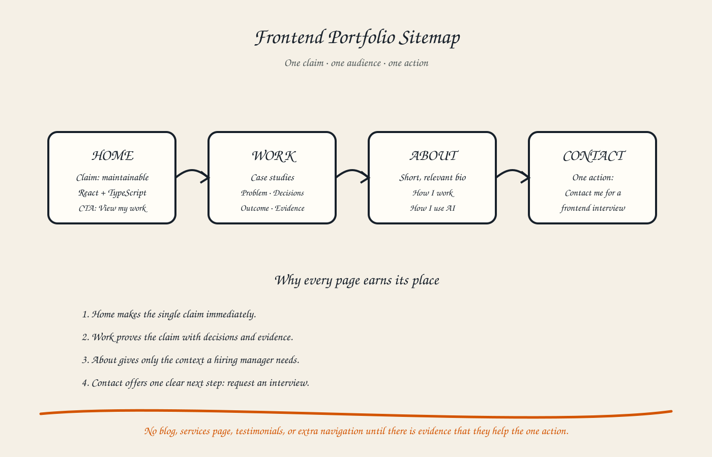

# Draw the Path: Portfolio Sitemap + Toolkit

## Proof statement

I can build maintainable frontend interfaces with React and TypeScript. The portfolio is for a technology-company hiring manager recruiting a junior frontend developer. The one action is to contact me for an interview.

## Sitemap



The portfolio contains only four sections:

1. **Home** — states the claim and points to the work.
2. **Work** — presents case studies using problem, decisions, outcome, and evidence.
3. **About** — provides a short relevant bio and explains how I work.
4. **Contact** — asks the hiring manager to contact me for a frontend interview.

Pages such as a blog, services, testimonials, and a separate technology catalog are intentionally excluded because they do not currently strengthen the claim or the one action.

## Final implementation continuity

The final Vite portfolio keeps these four content responsibilities but embeds
two capstone requirements inside the same one-page path: an **AI mentor**
between Work and Contact, and a short **Process** section explaining
verification. They are not unrelated pages added “just because.” The mentor is
the working artifact that proves the capstone, while Process makes the
AI-assisted decisions reviewable. About, Work, and Contact still serve the same
claim, audience, and action defined here.

## Toolkit status

- ChatGPT account: configured and used during the internship.
- Cursor account: configured and used for repository tasks.
- Claude free chat: account/login still requires user verification.
- Gemini and Perplexity: must be confirmed by the account owner.

## Project instruction used for the pressure test

```text
Act as a tutor, not as the author of my portfolio. Ask questions and challenge unsupported decisions.

Proof statement: I can build maintainable frontend interfaces with React and TypeScript. This portfolio is for a hiring manager at a technology company who is looking for a junior frontend developer. The single action I want that person to take is to contact me for an interview.

Keep advice direct, honest, clear, practical, approachable, and free of exaggeration. Do not add pages or claims unless they strengthen the proof statement and the one action.
```

## Pressure-test prompt

```text
Pressure-test this sitemap against my claim and one action:

Home → Work → About → Contact

Home states the React and TypeScript claim. Work contains case studies with problem, decisions, outcome, and evidence. About gives a short relevant bio and explains how I work with AI. Contact asks a hiring manager to contact me for a junior frontend interview.

For each section, tell me whether it strengthens the claim or moves the hiring manager toward the action. Identify anything missing, redundant, or distracting. Recommend the single highest-impact change without adding unnecessary pages.
```

## Pressure-test output

The sitemap is appropriately small, and every section can support the intended action. Home makes the claim visible, Work supplies evidence, About adds context, and Contact removes ambiguity about the next step.

The main weakness is not a missing page but the path order. A hiring manager may want a small amount of context before opening detailed case studies, while another may prefer evidence immediately. The current Home → Work order is still the stronger default because the claim should be proven as quickly as possible. About should remain brief and should not become a biography that delays the contact action.

The single highest-impact improvement is to keep a clear contact action near
the work and repeat it in the final Contact section. This reduces the distance
between proof and action without creating another page or distracting from the
project evidence.

## Change I will make

I will keep the four core responsibilities and avoid extra pages. The final
implementation adds the mentor and verification process only because later
capstone assignments require a working AI feature and an explainable workflow.

## Evidence note

The sitemap and pressure-test artifacts are complete. Screenshots of any configured external AI Project and third-party accounts must show the user's real authenticated accounts and should not be fabricated.
