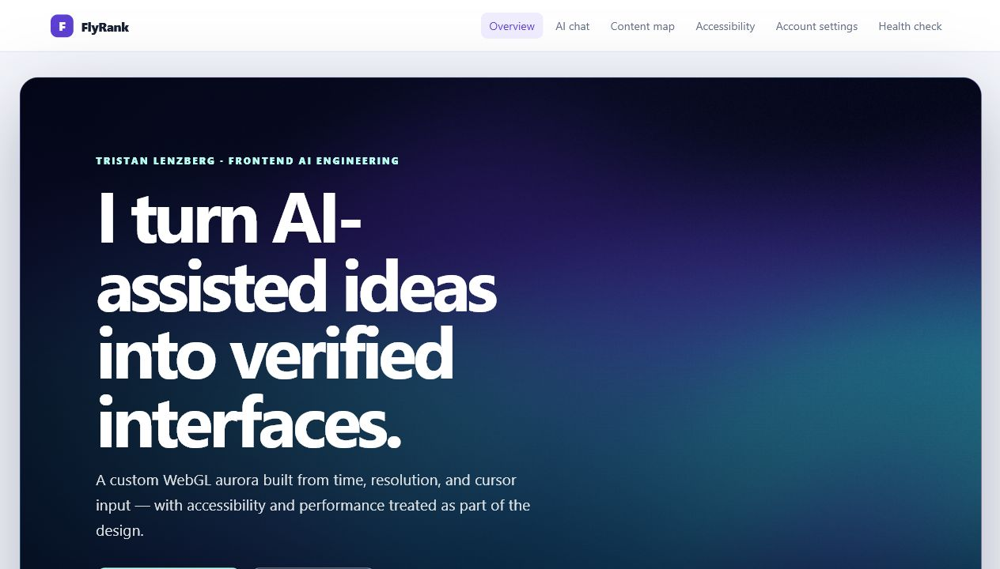
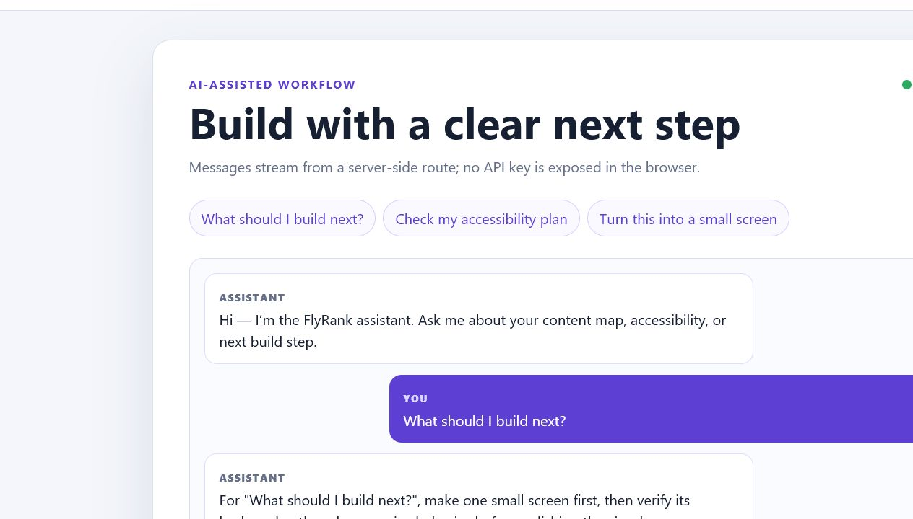
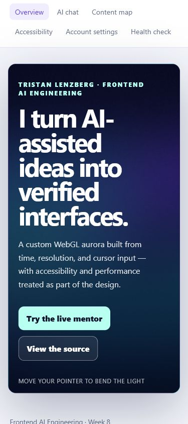

# FlyRank Frontend Capstone

> **Current state:** The production capstone is the canonical portfolio. It
> combines the personal framing developed in General AI Fluency with the
> interactive and verification requirements of Frontend AI Engineering.

An accessible React and TypeScript capstone that demonstrates two practical
AI-assisted workflows:

1. a streamed frontend-mentor interface with a protected server endpoint; and
2. a read-only portfolio evidence agent that checks GitHub files and public
   links before a case study is submitted.

The repository also includes a provenance-preserving snapshot of the
`flyrank-ml-internship` workspace: its notebooks, Python pipeline, anonymized
starter data, generated model report, charts, course documentation, and ML
skills library. See [ML-INTEGRATION.md](ML-INTEGRATION.md) before treating any
starter notebook as completed personal work.

The project is for reviewers, mentors, and junior-frontend hiring teams who
want to see both the result and the verification process behind it.

## Live projects

- **Canonical portfolio and production capstone:**
  <https://flyrank-frontend-capstone-eight.vercel.app>
- Dynamic mentor:
  <https://flyrank-frontend-capstone-eight.vercel.app/#chat>
- Earlier “Empty but Live” milestone:
  <https://tristan-empty-but-live.vercel.app>
- Source repository:
  <https://github.com/tristanlgb/flyrank-frontend-capstone>

The earlier URL is preserved as evidence of the Week 4 milestone. It used a
separate Next.js project. The final capstone uses React, TypeScript, and Vite
because that is the workflow I prefer and can explain most confidently.

## Screenshots

These screenshots document the pre-consolidation capstone interface. The live
URL is the source of truth for the current portfolio layout; new screenshots
should replace these before the final portal submission.

### Custom WebGL hero



### Dynamic mentor — completed production request



### Mobile layout



## What the dynamic feature does

The chat accepts one frontend question, sends it to the server-side
`/api/chat` endpoint, and progressively displays the returned response. The
endpoint validates input, limits repeated requests, protects the optional API
key, and falls back to a deterministic mentor response so the free demo still
works without paid usage.

See [MAKE-IT-DO-SOMETHING.md](MAKE-IT-DO-SOMETHING.md) for the plain-language
backend and data-flow explanation.

## Architecture

```text
Visitor
  |
  v
React + TypeScript interface
  |
  | POST /api/chat
  v
Vercel server function
  |-- validates message count and length
  |-- applies a per-client request limit
  |-- uses Claude when a server-side key exists
  `-- otherwise uses the free deterministic fallback
  |
  v
Streamed text response -> React conversation

Portfolio Evidence Agent
  |
  | reads input/request.json
  v
GitHub REST API + public URL checks
  |
  v
output/verification-report.md

ML Internship Snapshot
  |
  | anonymized sample + Python pipeline + notebooks
  v
client-holdout validation -> ranked refresh queue -> model report + charts
```

## Requirements

- Node.js 20 or newer
- npm
- Git
- Optional: Vercel CLI for running the server endpoint locally

## Setup

```bash
git clone https://github.com/tristanlgb/flyrank-frontend-capstone.git
cd flyrank-frontend-capstone
npm install
```

Start the frontend:

```bash
npm run dev
```

Open the local URL printed by Vite. The static screens work with this command.
To run `/api/chat` locally as a server function, install or invoke the Vercel
CLI and use:

```bash
npx vercel dev
```

## Environment variables

| Variable | Required | Purpose |
| --- | --- | --- |
| `ANTHROPIC_API_KEY` | No | Enables a live Claude response. It must exist only on the server. |
| `ANTHROPIC_MODEL` | No | Overrides the default Claude model name. |

With no API key, the endpoint returns a transparent deterministic fallback.
This avoids exposing a secret or requiring paid credits for basic evaluation.
No production environment variables are currently required or configured.

## Commands

```bash
npm run dev
npm run test
npm run test:coverage
npm run typecheck
npm run lint
npm run build
```

Run the evidence agent separately:

```bash
cd FL-07-AGENT-MVP
npm start
npm test
```

Its input is `FL-07-AGENT-MVP/input/request.json`; its report is written to
`FL-07-AGENT-MVP/output/verification-report.md`.

Run the imported ML reference pipeline separately:

```bash
cd ml-internship
python -m venv .venv
python -m pip install -r requirements.txt
python scripts/run_all.py
```

The ML folder has its own [data-use rules](ml-internship/DATA_USE.md) and
[code license](ml-internship/LICENSE). The bundled CSV is the approved,
anonymized starter slice; it must not be mixed with private client exports.

## V2 evaluation results

| Evaluation | Expected behavior | Current result |
| --- | --- | --- |
| Incomplete agent request | Reject before network work | Pass |
| Complete evidence set | Produce a `PASS` report | Pass |
| Missing evidence | Keep the missing file visible | Pass |
| Portfolio composition | Render personal framing, work, shader, mentor, process, and contact sections | Pass |
| Embedded dynamic mentor | Render an accessible labeled input | Pass |
| Production build | Type-check and create optimized assets | Pass |

Automated verification:

```text
Frontend and chat fallback: 7 tests passed
Current frontend coverage: 62.64% statements and lines
Agent: 3 tests passed
TypeScript: passed
Production build: passed
Production Lighthouse mobile: 86 performance, 100 accessibility,
  100 best practices, 100 SEO
Production axe WCAG 2.1 AA audit: 0 violations
```

The coverage command enforces a minimum of 50% for current source code. The
saved reports and audit method are documented in
[Testing Evidence](audits/TESTING-EVIDENCE.md) and
[Accessibility and Performance Audit](audits/ACCESSIBILITY-PERFORMANCE-AUDIT.md).

## Limitations

- The evidence agent proves that named files and links exist; it cannot prove
  that a written claim is persuasive or truthful in context.
- The GitHub connection is public and unauthenticated, so rate limits can
  temporarily stop a run.
- The chat's in-memory request limiter is appropriate for a small demo, not a
  high-traffic distributed service.
- Without `ANTHROPIC_API_KEY`, the chat demonstrates the full backend and
  streaming flow but uses a deterministic response rather than a model.
- Automated Safari testing is not included; mobile Safari needs a manual pass.
- The repository still contains historical assignment snapshots, so the main
  test configuration intentionally limits Vitest to `src/`.

## Important engineering decisions

- Keep API keys on the server.
- Cap requests at 12 messages and 1,000 characters per message.
- Cap server execution at 15 seconds.
- Keep the evidence agent read-only; it never commits, publishes, or rewrites
  portfolio claims.
- Treat missing evidence and network uncertainty as review items rather than
  inventing a successful result.

## Production protection

The `/api/chat` server function applies these limits before it calls an
external model:

- 12 messages maximum per request;
- 1,000 characters maximum per message;
- 10 requests per client during a 60-second window;
- 15-second maximum function duration;
- malformed JSON and unsupported HTTP methods are rejected;
- the optional API key remains server-side.

The current in-memory limiter is intentionally described as demo-level
protection. A production service running at higher scale should use a shared
durable rate-limit store.

## Browser and device pass

| Environment | Result | Evidence |
| --- | --- | --- |
| Chromium desktop | Pass | Hero, navigation, chat request, streamed response, and console checked in production |
| Responsive mobile, 390×844 | Pass | No horizontal overflow; all tested links and buttons are at least 44 px high |
| Firefox | Manual check pending | Firefox is not installed in the available Windows environment |
| Safari desktop | Manual check pending | Safari is not available on Windows |
| Mobile Safari on a real iPhone | Manual check pending | Must be opened and checked on an iPhone before portal submission |

The project does not claim Safari coverage that was not executed. The final
reviewer should record the browser versions and any fix made during those
manual checks.

## How AI tools helped build this

AI assistance was used to critique the first README, compare a vague prompt
with a constrained prompt, design pre-build evaluation cases, and review the
streaming workflow. Human verification caught a concrete integration bug: the
React client sent message text under `text`, while the server expected
`content`. The fix mapped the client data to the server contract and added
tests plus a production build check. AI output was treated as a draft; tests,
type checking, live checks, and Git diffs determined what was accepted.

## Demo checklist

For the FL-09 video:

1. Show this README and the architecture sketch.
2. Run the automated tests.
3. Open the live chat and submit “What should I build next?”
4. Explain why the API key stays on the server.
5. Show one limitation: without a key the free fallback is deterministic.
6. Run the portfolio evidence agent and open its generated report.

## Final submission package

- [structured capstone portfolio entry](CAPSTONE-PORTFOLIO-ENTRY.md)
- [one-page reflection](CAPSTONE-REFLECTION.md)
- [production deployment checklist and rollback plan](PRODUCTION-DEPLOYMENT-CHECKLIST.md)
- [testing evidence](audits/TESTING-EVIDENCE.md)
- [accessibility and performance audit](audits/ACCESSIBILITY-PERFORMANCE-AUDIT.md)
- [documentation continuity guide](DOCUMENTATION-CONTINUITY.md)
- [Machine Learning integration guide](ML-INTEGRATION.md)
- [FE-12 case study](FE-12-CASE-STUDY.md)
- [2–3 minute demo script](FE-12-DEMO-SCRIPT.md)
- [actual-hours log](FE-12-HOURS-LOG.md)
- [LinkedIn completion draft](FE-12-LINKEDIN-DRAFT.md)
- [final portal package](FE-12-FINAL-SUBMISSION.md)

## License

[MIT](LICENSE)
